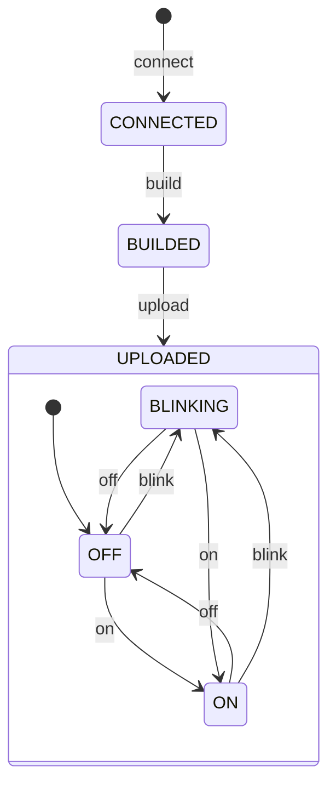
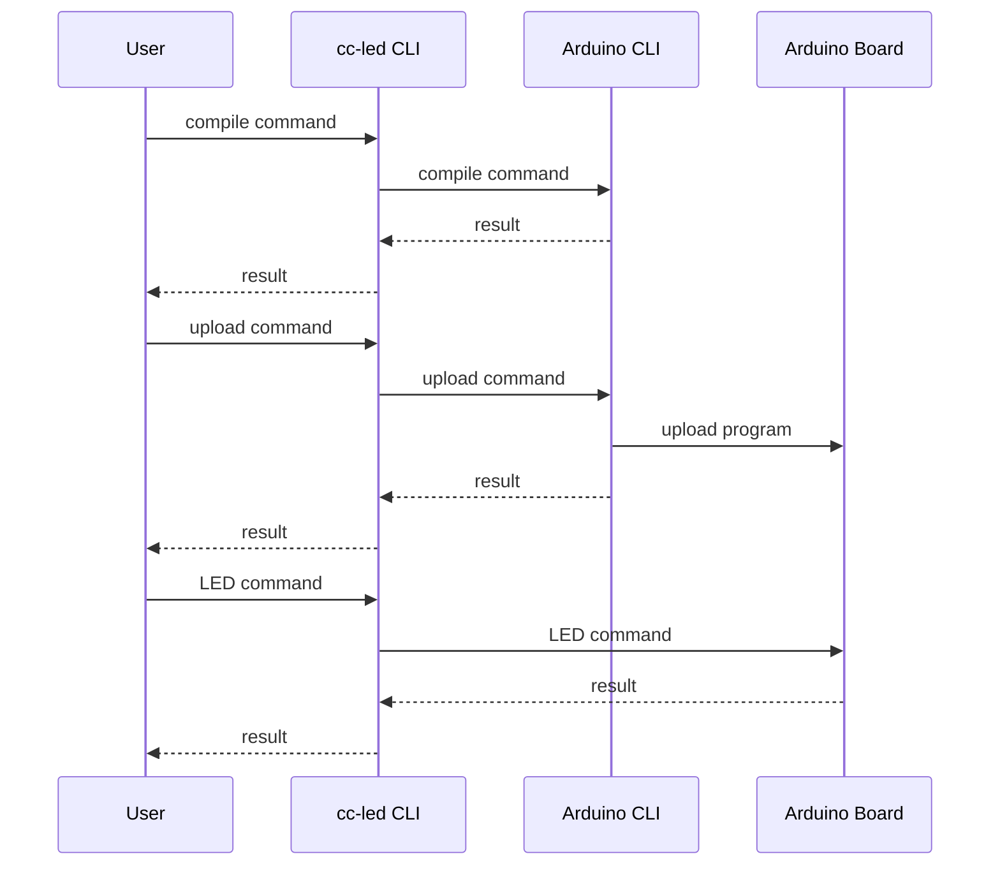
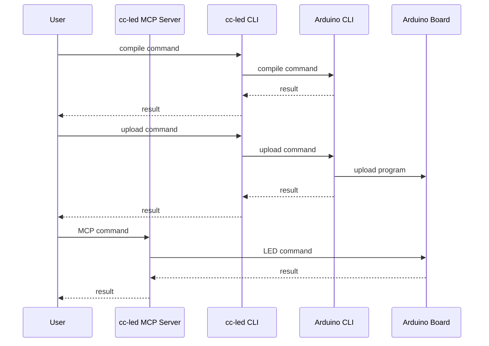

# ARCHITECTURE

## State

```mermaid
stateDiagram
  state "CONNECTED" as C
  state "BUILDED" as B
  state "UPLOADED" as U
  state "BLINKING" as L
  state "ON" as ON
  state "OFF" as OFF
  [*] --> C : connect
  C --> B : build
  B --> U : upload
  state U {
      [*] --> OFF
      OFF --> ON : on
      ON --> OFF : off
      L --> OFF : off
      OFF --> L : blink
      L --> ON : on
      ON --> L : blink
  }
```

## Sequence

CLI Command Flow

```mermaid
sequenceDiagram
  participant U as User
  participant C as cc-led CLI
  participant A as Arduino CLI
  participant B as Arduino Board
  U->>C: compile command
  C->>A: compile command
  A-->>C: result
  C-->>U: result
  U->>C: upload command
  C->>A: upload command
  A->>B: upload program
  A-->>C: result
  C-->>U: result
  U->>C: LED command
  C->>B: LED command
  B-->>C: result
  C-->>U: result
```

MCP Command Flow

```mermaid
sequenceDiagram
  participant U as User
  participant S as cc-led MCP Server
  participant C as cc-led CLI
  participant A as Arduino CLI
  participant B as Arduino Board
  U->>C: compile command
  C->>A: compile command
  A-->>C: result
  C-->>U: result
  U->>C: upload command
  C->>A: upload command
  A->>B: upload program
  A-->>C: result
  C-->>U: result
  U->>S: MCP command
  S->>B: LED command
  B-->>S: result
  S-->>U: result

```
